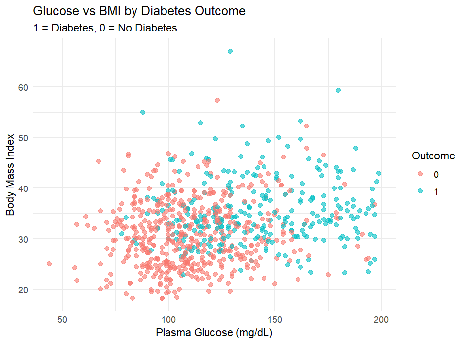
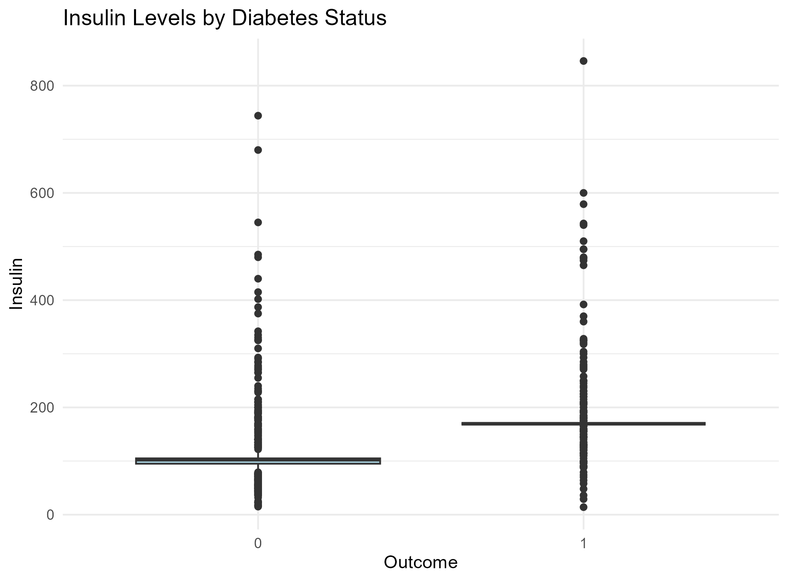

# Diabetes Risk Simulator
A Python/R-based quantitative risk modeling tool for diabetes onset prediction. It loads the classic Pima Indians Diabetes dataset, cleans invalid/missing values, forecasts risk using logistic regression, evaluates probabilistic outcomes, computes classification performance metrics, and provides interpretable risk insights for clinical or population health decision-making.
Built as a portfolio project to demonstrate skills in healthcare data analytics, statistical modeling, risk quantification, and reproducible workflows—directly relevant to health services research, population health, and predictive analytics roles.

## Overview
This tool:
- Processes real clinical data from the Pima Indians Diabetes Database (768 patient records)
- Cleans invalid zeros (treated as missing) and imputes using group-wise medians
- Fits logistic regression to predict diabetes onset within 5 years
- Evaluates model performance (accuracy, sensitivity, specificity, confusion matrix)
- Generates visualizations (scatter plots, boxplots) and odds ratios for interpretability
- Exports results and risk insights for stakeholders

Goal: Help healthcare teams answer questions like  
"What is the predicted risk of diabetes for a patient with given glucose/BMI/age, and which factors drive the highest risk?"

## Skills Demonstrated
- Healthcare data cleaning & imputation (handling clinical data quality issues)
- Statistical modeling (logistic regression for binary outcomes)
- Risk quantification & interpretability (odds ratios, confidence intervals)
- Data visualization & reporting (ggplot2 scatter/boxplots, saved PNGs)
- Reproducible workflows in **R** (tidyverse, caret, RSQLite for SQL integration)
- SQL for data extraction and transformation (SQLite database simulation)
- Analytical thinking (interpreting model outputs for clinical/policy recommendations)

## Data Source
- Pima Indians Diabetes Database (UCI Machine Learning Repository / Kaggle)
- 768 observations, 9 features (Pregnancies, Glucose, BloodPressure, SkinThickness, Insulin, BMI, DiabetesPedigreeFunction, Age, Outcome)
- Binary outcome: 1 = diabetes onset within ~5 years, 0 = no diabetes
- Link: https://www.kaggle.com/datasets/uciml/pima-indians-diabetes-database

Note: Zeros in Glucose, BloodPressure, SkinThickness, Insulin, and BMI are treated as missing values (standard practice for this dataset).

## Demo Outputs

### Glucose vs BMI by Diabetes Outcome


Scatter plot shows clear separation: patients with diabetes (blue) tend to have higher glucose and BMI values. Strong positive association visible in both dimensions.

 Glucose and BMI are key screening targets; patients above ~140 mg/dL glucose and ~35 BMI warrant closer monitoring or preventive interventions.

### Insulin Levels by Diabetes Status


The boxplot shows significantly higher median and more variable insulin levels in diabetic individuals (Outcome = 1), with extreme outliers reaching up to ~800 μU/mL. This reflects insulin resistance and compensatory hyperinsulinemia, common in type 2 diabetes. The non-diabetic group (Outcome = 0) exhibits a tighter distribution with lower median values, indicating better insulin sensitivity. These patterns support insulin as a key marker for risk stratification and targeted interventions.

## Sample Risk Report
[Download diabetes_risk_report.xlsx](diabetes_risk_report.xlsx)  
(Sheets: Cleaned_Data, Model_Summary, Odds_Ratios, Confusion_Matrix)

## How to Run
1. Clone the repo
2. Install dependencies:
   ```bash
   # In R console or script
   install.packages(c("tidyverse", "DBI", "RSQLite", "caret", "pROC"))
